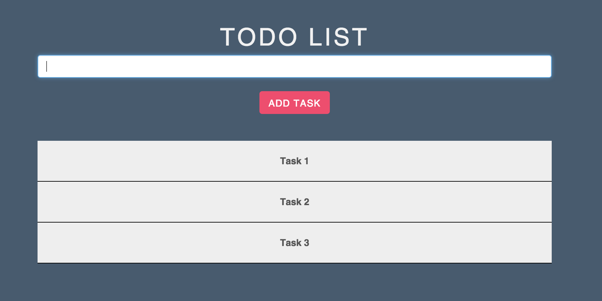

##To get started:
1. Install [NodeJS](http://www.nodejs.org)
2. Download this repo
3. Open the command line of your choice and cd to the root directory of this repo on your machine
4. `npm install` - Installs packages
5. `npm install -g gulp` - Installs gulp globally.
5. `gulp` - Builds the project and opens your browser.
6. Navigate to [http://localhost:9005/](http://localhost:9005/) if your browser doesn't open automatically.

##Todo App

This is a basic todo app in React. So far I'm able to add and show task on the main page

Wish List
Edit
Delete
Save in a database

###Screenshots

